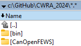
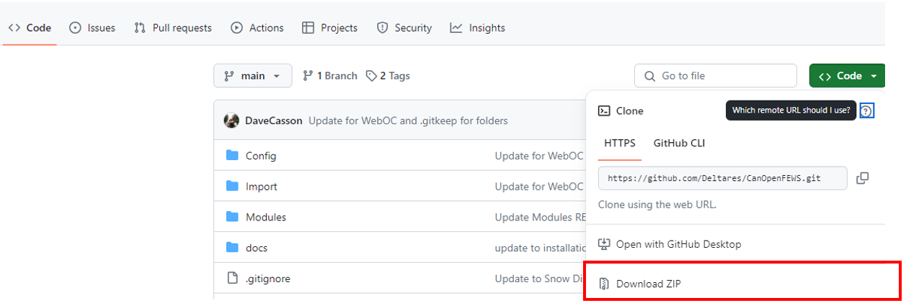
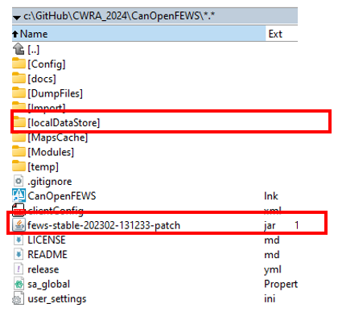
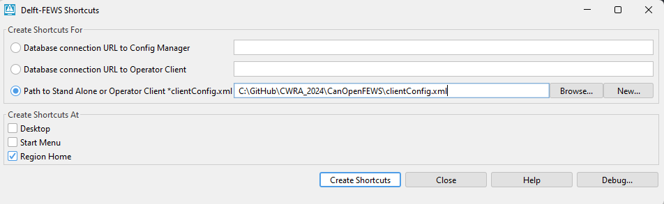
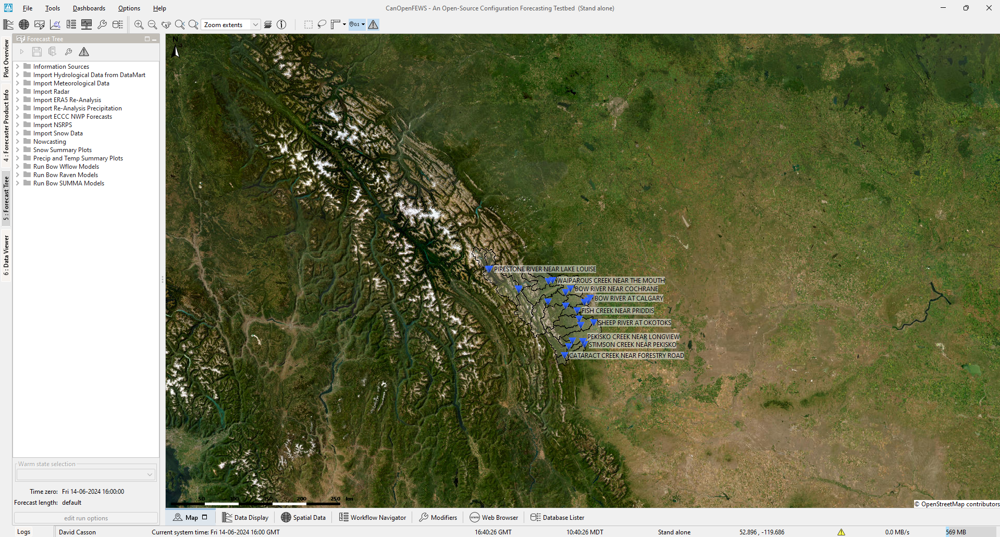
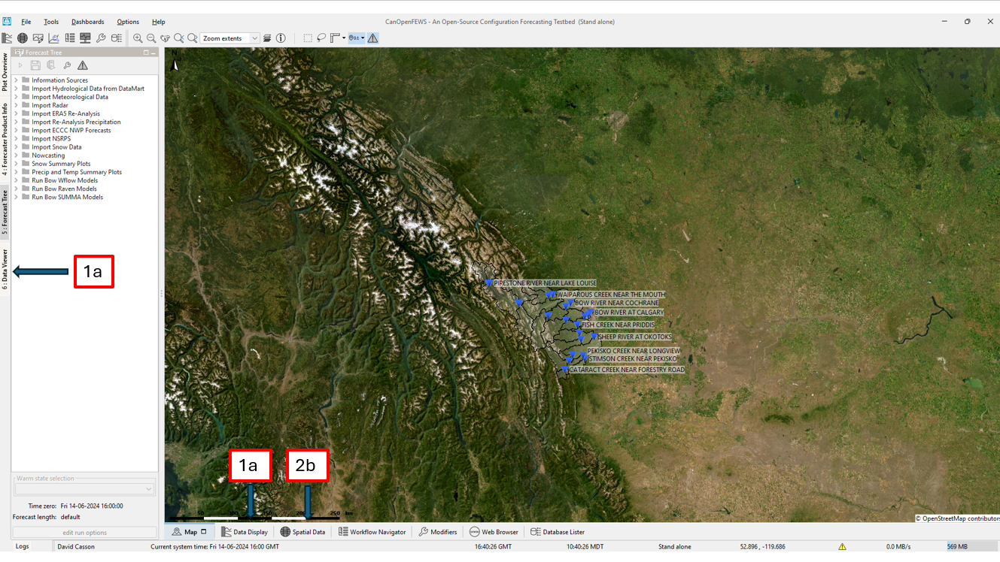
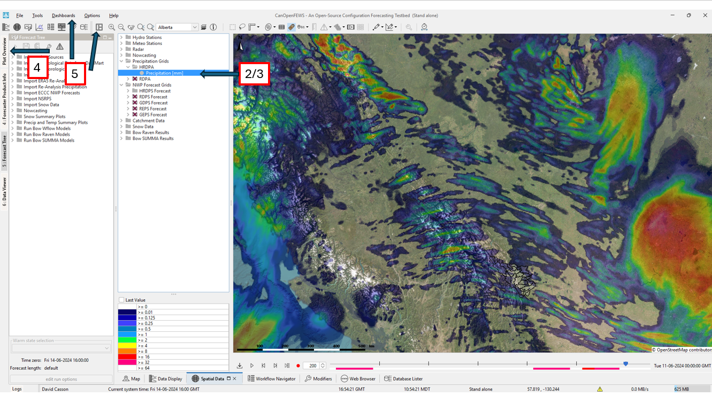
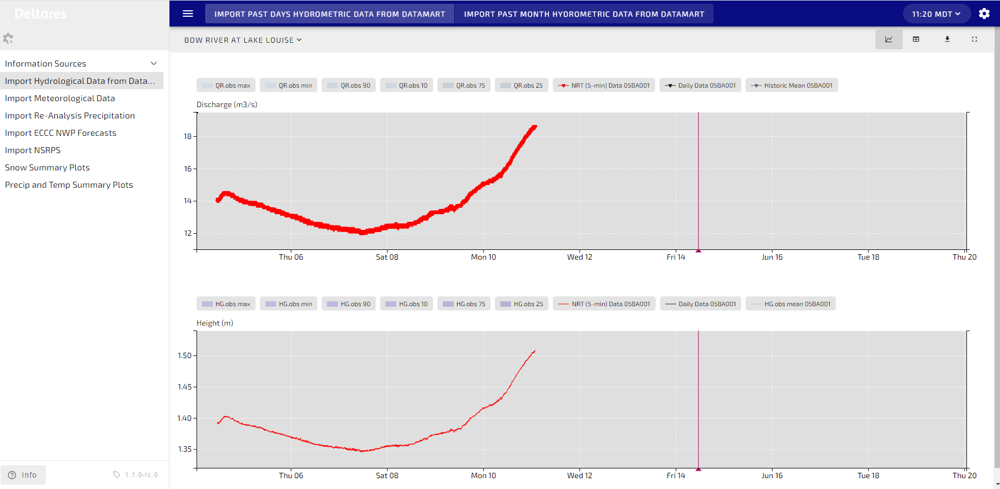

# Verification Workshop Instructions

Thank you for participating in the Verification Workshop!


There is a wide range in experience between users, from brand new to expert users.
These instructions provide setup steps and verification tasks, based on your ability and interest.
Feel free to follow along with another participant. If you are a beginner, ignore the optional tasks in the instructions.
You can always come back.


#### Get set up with OpenFEWS

1. Create a new directory (i.e. `./VerificationWorkshop`)

2. In this new directory, create two sub-directories
  - `./VerificationWorkshop/OpenFEWS/`
  - `./VerificationWorkshop/bin/`

     


3. Go to the OpenFEWS GitHub [here](https://github.com/CH-Earth/OpenFEWS).

  Optional: If you are interested to contribute, and are familiar with GitHub, fork and clone the GitHub repository. Instructions for this are at the bottom of this document.

4. Download the configuration as a .zip file, unzip the contents in `VerificationWorkshop/OpenFEWS/`.

    

5. From the provided link, unzip the patch.jar into the `./VerificationWorkshop/OpenFEWS/` directory

    

6. Unzip the LocalDataStore.zip into the `./VerificationWorkshop/OpenFEWS/` directory (as above)

7. Unzip the Delft-FEWS binaries into the `./VerificationWorkshop/bin/` directory

8. Go into the `./VerificationWorkshop/bin/windows/` directory, and open `create_shortcuts.exe`

    

9. Once the shortcut has been created, open the `OpenFEWS.lnk` from the `./VerificationWorkshop/OpenFEWS/` directory

10. OpenFEWS should open to the landing page. Verify that the configuration loads and explore the data available.

  

## Verification Tasks

1. Verify station discharge data for the Bow River at Calgary

  - Find this in the Data Viewer on the Right Side, Hydro and Meto Station Data
  - Select the location and parameter, then open the Data Display
  - Confirm that recent discharge values are visible and look reasonable

  

2. Verify snow products in the mountains

  - Go to the Spatial Display, and check the SnowCast and SNODAS results.
  - Confirm that snow cover displays correctly
  - Can you find the melt rate (under SNODAS)?

3. Verify NWP temperature forecasts for Saskatoon

  - In the Spatial Display, go to the NWP Forecast Grids and then the HRDPS forecast.
  - Select a variable to see the grid, and double click on the grid location to see the forecast.
  - Confirm that forecast values load for your selected location

  

4. Verify snow summary plots at Sunshine Village

  - Navigate to the Forecast Tree on the left side, navigate to the Snow Summary Plots.
  - Click on the Snow @ Stations
  - Find the Plot Overview and drag it to the right side of the screen
  - Open the Plot Overview to see thumbnails of the Modelled and Measured Snow
  - Click on one of the plots to enlarge it.
  - Find Sunshine Village and verify that both modelled and measured snow data are available


5. Verify dashboard functionality
  - On the top of FEWS, select the Dashboard and create a new one with a unique name.
  - Navigate to the Spatial Display, and add any active display with the Dashboard icon (or Alt+Insert)
  - Confirm that displays update correctly on the dashboard
  - Optional: build a themed dashboard (e.g. rain or snow) and note any issues you encounter


## Advanced Verification Tasks

1. Verify Python-enabled import workflows

  - Access the Python311Binaries.zip here: https://zenodo.org/records/10369455
  - Download and unzip to your `./Modules` folder. This will result in `./Modules/Python311`
  - Run the Import Re-Analysis Precipitation --> Import HRDPA workflow
  - Confirm that the workflow completes successfully


2. Verify WebOC operation

  - Ensure the WebOC zip file has been added to the Modules WebOC folder
  - Ctrl F12+M, Start TomCat WebServices
  - In a local browser, open http://localhost:8080/
  - Confirm that the WebOC loads and displays as expected

      


3. Verify the GitHub contribution workflow

 - Follow the instructions below to fork, branch, and open a pull request against OpenFEWS.


4. Help other participants :)

### Collaborating on GitHub with the CH-Earth/OpenFEWS Repository

 #### Step 1: Fork the Repository

 1. Open your web browser and go to the GitHub repository: [CH-Earth/OpenFEWS](https://github.com/CH-Earth/OpenFEWS).
 2. In the top-right corner of the page, click the **Fork** button.
    - This creates a copy of the repository in your GitHub account.


 #### Step 2: Clone the Repository

 1. After forking the repository, go to your GitHub account where the forked repository is located.
 2. Click on the **Code** button and copy the URL provided under "Clone with HTTPS" or "Clone with SSH", depending on your setup.
 3. Open your terminal (or Command Prompt on Windows).
 4. Type the following command and replace `<url>` with the URL you just copied:
    ```bash
    git clone <url>
    ```
 5. Press **Enter**. Your local clone will be created.

#### Step 3: Create a New Branch

 1. Move into the cloned directory:
    ```bash
    cd OpenFEWS
    ```
 2. Now, create a new branch using the `git checkout` command:
    ```bash
    git checkout -b your-new-branch-name
    ```
    Replace `your-new-branch-name` with the name you wish to give your branch.

#### Step 4: Make Changes Locally

 1. Open the project files in your preferred code editor.
 2. Make your changes to the files.
 3. Save the changes locally.

#### Step 5: Commit and Push Changes

 1. Go back to your terminal.
 2. Stage the changes for commit:
    ```bash
    git add .
    ```
 3. Commit the changes:
    ```bash
    git commit -m "Enter your commit message here"
    ```
 4. Push the changes back to your GitHub repository:
    ```bash
    git push origin your-new-branch-name
    ```

#### Step 6: Create Pull Request

 1. Go to your repository on GitHub.
 2. You'll see a `Compare & pull request` button. Click on it.
 3. You'll be taken to a page where you can create the pull request.
    - You can choose the branch that you made your changes in to compare with CH-Earth's main branch (`main`).
 4. Add a title and description for your pull request.
 5. Click on **Create pull request**.

 Congratulations! You have now forked, cloned, and proposed changes to the CH-Earth/OpenFEWS repository.

####  Requirements for your laptop
To use Delft-FEWS, you will need a computer with
  - Operating System: Windows 10 or later, Linux
  - Disk Space: At least 1 GB free to use sample data
  - Java: Java Runtime Environment (JRE) 8 or higher (search "about Java" on your machine)
